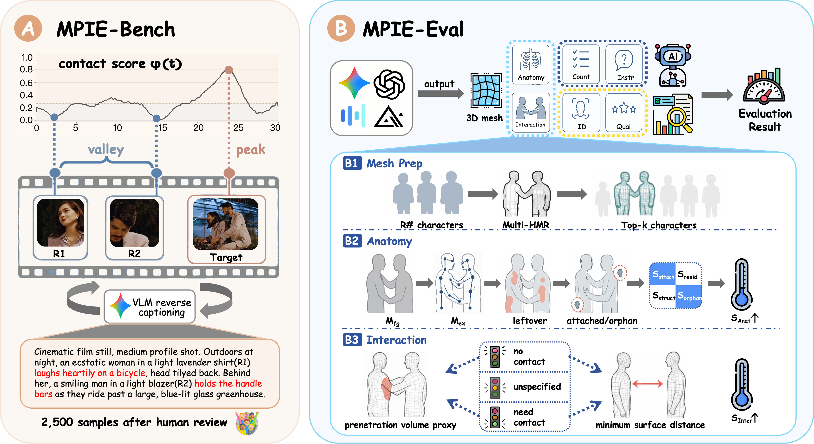
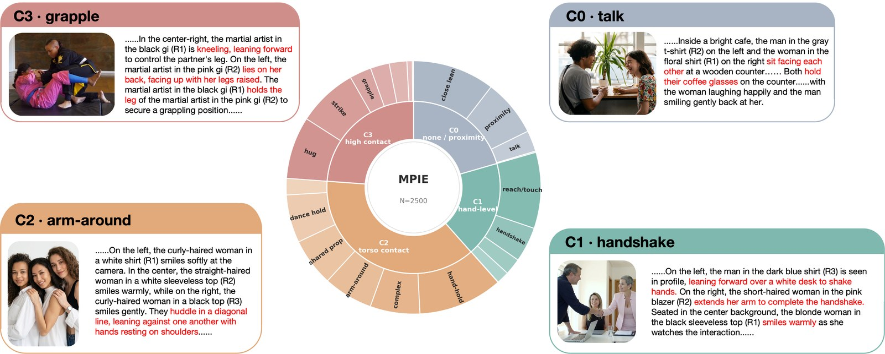
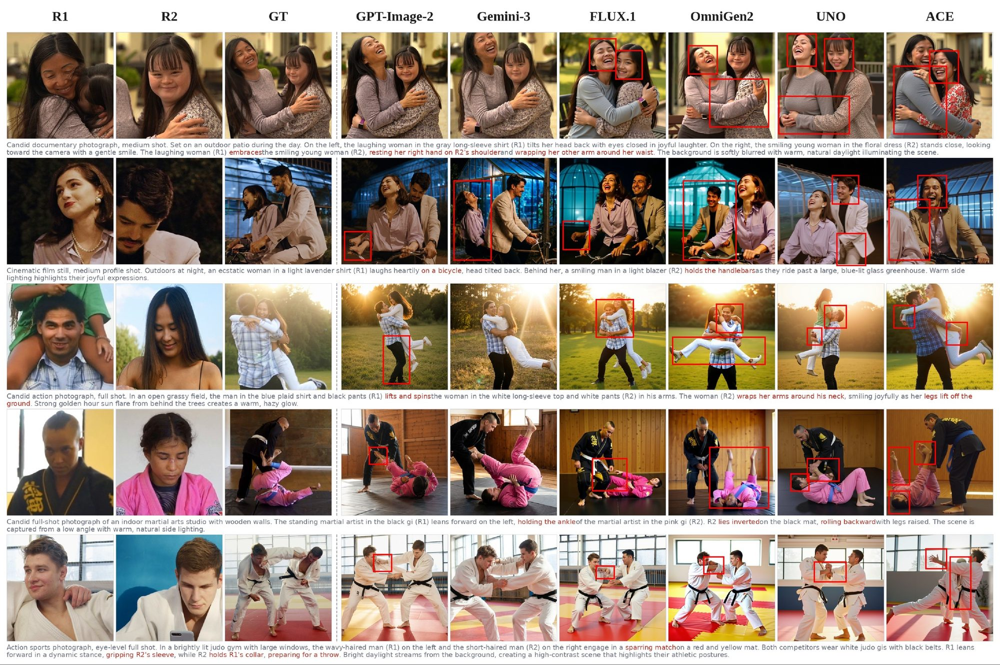

<div align="center">

# MPIE-Bench

### Multi-Person Interaction-Aware Character-Consistent Editing Benchmark

Evaluate multi-person image editing across identity, anatomy, interaction,
instruction following, person count, and visual quality.

[Quick start](#quick-start) · [Evaluation](#evaluation-protocol) · [Generation](#optional-baseline-generation) · [Documentation](#documentation)

</div>

> [!NOTE]
> This repository provides the **official 2,500-sample test set**, evaluation
> protocol, and scoring code. Place model outputs under
> `data/testset/outputs/<model_id>/` and run the E2E scorer.

<p align="center">
  
</p>
<p align="center">
  <sub>Overview: (A) video-mined data construction with VLM reverse captioning; (B) six-axis MPIE-Eval with mesh-anchored Anatomy / Interaction.</sub>
</p>

## Overview

MPIE-Bench evaluates whether an editing model can combine multiple character
references with an interaction instruction while preserving:

- the correct number of people;
- each person's identity;
- plausible anatomy and interaction geometry;
- instruction fidelity and overall image quality.

The benchmark contains **2,500 test cases**, organized by contact density from
**C0** (no contact) to **C3** (dense contact).

<details>
<summary><strong>Explore the benchmark visuals</strong></summary>
<br>

<p align="center">
  
</p>
<p align="center">
  <sub>Contact-density taxonomy (C0–C3) with representative scenes and prompts.</sub>
</p>

<p align="center">
  <a href="docs/assets/qualitative.jpg">
    
  </a>
</p>
<p align="center">
  <sub>Reference identities, held-out ground truth, and model failures under contact. Click to enlarge.</sub>
</p>

</details>

## Quick start

### 0. Install scoring environments

See **[`docs/INSTALL.md`](docs/INSTALL.md)** (conda/pip + weights).

```bash
conda create -y -n mpie python=3.10 && conda activate mpie
pip install -r env/requirements-eval.txt
bash env/setup_eval.sh --arcface-weights
# place HPSv2 weights under $MPIE_WEIGHTS/hpsv2/ (see INSTALL.md)
```

### 1. Point at the official test set

```bash
export MPIE_TEST_PACK="$PWD/data/testset"
```

See [`data/testset/README.md`](data/testset/README.md). Optional frozen judgments
for **three closed-source** baselines: [`docs/BASELINES.md`](docs/BASELINES.md).
Open-source model dumps are not published. Closed-source PNGs:

```bash
bash scripts/fetch_closed_outputs.sh   # pulls Git LFS branch assets/closed3
```

### 2. Configure the evaluation

```bash
cp configs/eval.env.example configs/eval.env
```

Set `MULTIHMR_REPO`, `AI_GATEWAY_URL` / `AI_GATEWAY_KEY`, and GPU count.

### 3. Add model outputs

```text
$MPIE_TEST_PACK/outputs/<model_id>/<sample_id>.png
```

### 4. Run all six evaluation axes

```bash
bash code/eval/run_eval_e2e.sh --model <model_id>
```

```bash
NGPU=8 bash code/eval/run_eval_e2e.sh --model my-model
bash code/eval/run_eval_e2e.sh --model my-model --axes id,qual,mesh
EVAL_LIMIT=20 bash code/eval/run_eval_e2e.sh --model my-model
```

Guides: [INSTALL](docs/INSTALL.md) · [E2E](docs/02_pipeline_design/eval_e2e.md) · [BASELINES](docs/BASELINES.md).

## Evaluation protocol

Protocol **v3** scores six complementary axes in one pipeline:

| Axis | What it measures | Method |
|:--|:--|:--|
| **Count** | Correct number of people | VLM judge |
| **Identity** | Per-person identity preservation | ArcFace |
| **Anatomy** | Human-body plausibility | Multi-HMR mesh |
| **Interaction** | Intended contact and spatial relations | Multi-HMR mesh |
| **Instruction** | Edit-instruction fidelity | Instr v2 |
| **Quality** | Overall perceptual quality | HPSv2 |

> [!IMPORTANT]
> **Anatomy and Interaction are not pass/fail checklists.** They support the
> construct validity of a geometry-based evaluation stack: human preference is
> the anchor, the mesh stack tracks human judgment, and VLM-only judges tend to
> inflate scores.

Read the
[construct-validity principle](docs/02_pipeline_design/eval_construct_validity_principle.md)
and the full [v3 protocol](docs/02_pipeline_design/eval_protocol_v3.md).

## Optional baseline generation

Run an open-source baseline before scoring:

```bash
# create a conda env with the scoring dependencies (ArcFace / HPSv2 / etc.)

cd code/eval
export MPIE_TEST_PACK=/path/to/mpie_testset_pack
export MPIE_WEIGHTS=/path/to/mpie_weights
LIMIT=2 NGPU=1 bash run_opensource_full_8gpu.sh kontext
```

For additional models and known setup issues, see
[open-source generation](docs/02_pipeline_design/eval_opensource.md). For API
models, see the [closed-source runner guide](code/eval/closedsource/README.md).

## Repository layout

```text
data/testset/         # Official N=2500 pack (images, manifest, Instr QA)
code/
├── eval/             # E2E runner, scorers, and baseline generators
├── pipeline/         # Dataset construction and extension
├── review_frontend/  # Optional human-review interface
└── common/           # Shared utilities
configs/              # Evaluation configuration templates
docs/                 # Protocol and usage documentation
```

Optional local paths (weights / third-party repos):

```bash
export MPIE_TEST_PACK="$PWD/data/testset"
export MPIE_WEIGHTS=/path/to/mpie_weights
export MULTIHMR_REPO=/path/to/multi-hmr
export MPIE_CODE=/path/to/third_party_model_repos  # optional
```

Store secrets only in environment variables or `configs/eval.env`.

## Documentation

- **[Install](docs/INSTALL.md)** — conda/pip + weight download
- **[Closed-source baselines](docs/BASELINES.md)** — optional 3-model artifacts
- **[End-to-end evaluation](docs/02_pipeline_design/eval_e2e.md)** — `run_eval_e2e.sh`
- **[Evaluation protocol v3](docs/02_pipeline_design/eval_protocol_v3.md)** — main-table definition
- **[Documentation index](docs/README.md)** — full index

## Project status

The current main-table protocol uses mesh-based Anatomy and Interaction,
Instr v2, ArcFace, and HPSv2. Contact-density levels are defined as C0–C3.
The official test set is published under [`data/testset/`](data/testset/README.md);
protocol details live in [`docs/`](docs/README.md).

## Citation

BibTeX will be added when the paper is publicly available.

## License

Code is released under the [Apache License 2.0](LICENSE). Third-party model
weights and source datasets remain subject to their respective licenses.
